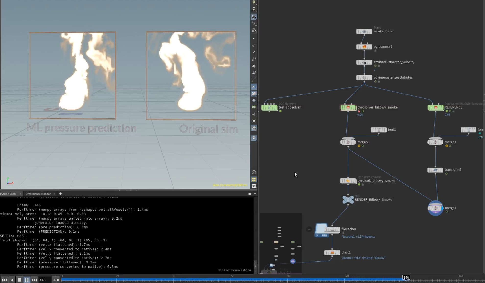

# Neural Pressure Prediction (for Houdini Pyro Simulations)
#### A full data pipeline and neural training setup to enhance the pressure solve in a Houdini pyro solver.

This is a research project started at Untold Studios in London back in 2022 where we deemed it not worth further pursuing, but with more dedicated time in the current year, the outcome was improved to a point where results are feasible. 

The main development which made it reasonable was the addition of the H20 **ONNX SOP** which allows the evaluation of a model within Houdini without exporting the data for each frame. Previously, this was a bottleneck and would have required a custom C++ plugin to handle I/O of the data not through python or be slowed down by disk writing speeds.

A very early state of implementation of first iteration: https://youtu.be/wc9lWMOSP_4

The current state of inference with dynamic Generator sizing:
[!Inference Dynamic Generator](./media/inference_dynamic.png)

## Requirements (Windows)
`environment\environment.yml` file is included in root directory and is to be installed with any Conda install.
- Python 3.9
- tensorflow=2.10.0

###### (GPU)
Needs to be installed separately on most systems, sometimes the conda install succeeds though, it's included in the *.yml*, otherwise: 

[CUDA Toolkit Archive](https://developer.nvidia.com/cuda-toolkit-archive) and [cuDNN Archive](https://developer.nvidia.com/rdp/cudnn-archive)
- Cuda: 11.2
- cuNN: 8.1

## Requirements (WSL)
The `environment\environment_wsl.yml` is for Windows Subsystem for Linux, where I made it run on Ubuntu 22.04 (wsl2)
- Python 3.9
- tensorflow=2.16.1

###### (GPU)
- Cuda: 12.3
- cuDNN: 8.9

## Data Preparation
When first opening the file, the linked custom Pyro Solver will need to be linked, it is easiest by adding the project directory to the Houdini-path in houdini.env or putting the provided package *.json* in your env folder
In the Houdini file, set the custom Pyro Solver to **"Data Generation Mode"** and run wedges

## Training
* Load the conda environment, navigate to the project root and launch jupyter lab (automated in `environment/pressure_predict_jupyter_launcher.bat`)
* Open jupyter lab in browser (manually if not automatically opening default browser, eg. on WSL) and open the jupyter notebook
* Run all cells

## Evaluation
* Change the solver to **"Evaluation Mode"**
* Locate exported .h4 or .onnx file under `models/` and set the path on the solver
* ...
* Profit!
